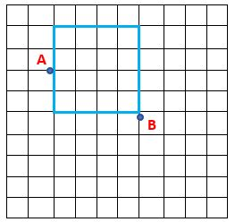
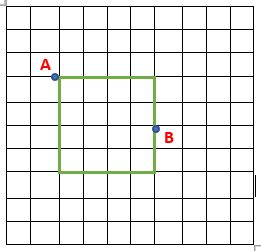

SHortest Path Between Two Points
===
Generating a random matrix of 20 X 20 representing cost of moving from one location to another.  
User have to enter two location representing source and destination.  
Multiple paths are possible depenting upon on which frame they are laying, the output will be the shortest path between source and destination among different frames.  
Example :  
User will choose point A and B allowing thesetwo possible frame -

Frame 1  

Frame 2  

Out of the two frames whichever is smaller will be returned.

To calculate the shortest path **GREEDY ALGORITHIM** is used. 

Greedy Algorithim 
---
A greedy algorithm is a simple, intuitive algorithm that is used in optimization problems. The algorithm makes the optimal choice at each step as it attempts to find the overall optimal way to solve the entire problem.
